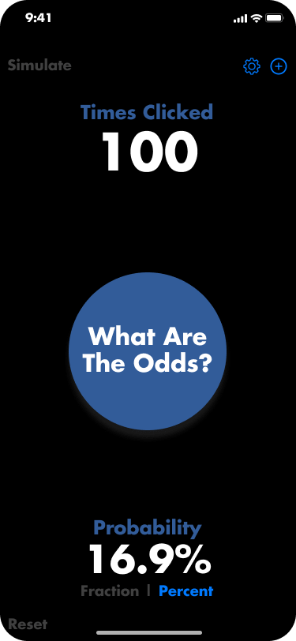
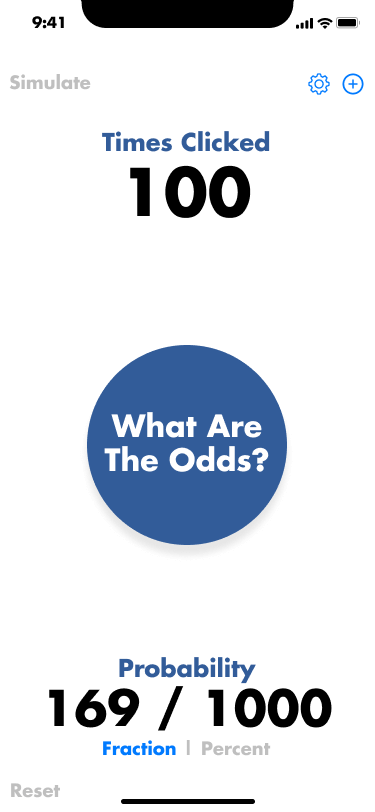
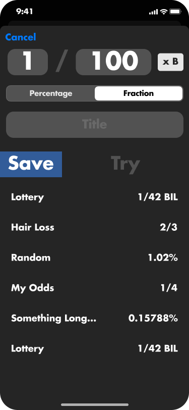

<h1 align="center">What Are The Odds?</h1>
<p>
  
</p>

> React Native clicker app that tests your luck by pressing a button until you hit a probability


## Install

```sh
yarn install
```

## Usage

```sh
yarn run start
```
## Screen Shots
<div style="display: flex; justify-content: space-around; flex-wrap: wrap ">
  
  
  
  
</div>

## Author

👤 **Pablo Padilla**

* Website: https://www.pablopadilla.net/
* Github: [@PPadilla44](https://github.com/PPadilla44)
* LinkedIn: [@pablo-padilla-6861b5137](https://linkedin.com/in/pablo-padilla-6861b5137)

## Show your support

Give a ⭐️ if this project helped you!

***
_This README was generated with ❤️ by [readme-md-generator](https://github.com/kefranabg/readme-md-generator)_
